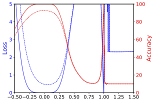
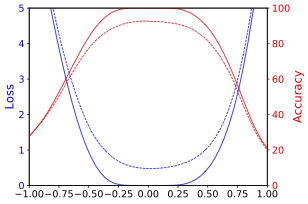
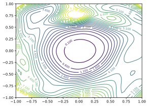
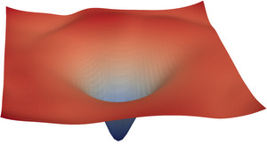

# Visualizing the Loss Landscape of Neural Nets


This repository contains the PyTorch code for the paper
> Hao Li, Zheng Xu, Gavin Taylor, Christoph Studer and Tom Goldstein. [*Visualizing the Loss Landscape of Neural Nets*](https://arxiv.org/abs/1712.09913). NIPS, 2018.

Given a network architecture and its pre-trained parameters, this tool calculates and visualizes the model's surrounding loss surface along random direction(s) on the training set.
The calculation can be done in parallel with multiple GPUs with multiple nodes.
The direction(s) and the surface values are stored in HDF5 (`.h5`) files.

## Setup

**Environment**: One multi-GPU node with following software/libraries installed:
- [PyTorch 0.4](https://pytorch.org/)
- [openmpi 3.1.2](https://www.open-mpi.org/)
- [mpi4py 2.0.0](https://mpi4py.scipy.org/docs/usrman/install.html)
- [numpy 1.15.1](https://docs.scipy.org/doc/numpy/user/quickstart.html)  
- [h5py 2.8.0](http://docs.h5py.org/en/stable/build.html#install)
- [matplotlib 2.0.2](https://matplotlib.org/users/installing.html)

**Pre-trained models**:
The code accepts pre-trained PyTorch models for CIFAR-10 dataset.
To load the pre-trained model correctly, the model file should contain `state_dict`, which is saved from the `state_dict()` method.
The default path for pre-trained networks is `cifar10/trained_nets`.
Some of the pre-trained models and plotted figures can be downloaded here:
- [VGG-9](https://drive.google.com/open?id=1jikD79HGbp6mN1qSGojsXOZEM5VAq3tH) (349 MB)
- [ResNet-56](https://drive.google.com/a/cs.umd.edu/file/d/12oxkvfaKcPyyHiOevVNTBzaQ1zAFlNPX/view?usp=sharing) (10 MB)
- [ResNet-56-noshort](https://drive.google.com/a/cs.umd.edu/file/d/1eUvYy3HaiCVHTzi3MHEZGgrGOPACLMkR/view?usp=sharing) (20 MB)
- [DenseNet-121](https://drive.google.com/a/cs.umd.edu/file/d/1oU0nDFv9CceYM4uW6RcOULYS-rnWxdVl/view?usp=sharing) (75 MB)

**Data preprocessing**:
The data normalization method for visualization should be consistent with the one used for model training.
No data augmentation (random cropping or horizontal flipping) is used in calculating the loss values.

## Visualizing 1D loss curve

### 1D linear interpolation
The 1D linear interpolation method [1] evaluates the loss values along the direction between two solutions of the same network. It was used to compare the flatness of minimizers trained with different batch sizes [2].

```
mpirun -n 4 python plot_surface.py --mpi --cuda --model vgg9 --x=-0.5:1.5:401 --dir_type states \
--model_file cifar10/trained_nets/vgg9_sgd_lr=0.1_bs=128_wd=0.0_save_epoch=1/model_300.t7 \
--model_file2 cifar10/trained_nets/vgg9_sgd_lr=0.1_bs=8192_wd=0.0_save_epoch=1/model_300.t7
```
- `--x=-0.5:1.5:401` sets the range of step size and the number of sampling points to be 401.
- `--dir_type states` indicates the direction contains dimensions for all parameters as well as the statistics of the BN layers (`running_mean` and `running_var`). Note that ignoring `running_mean` and `running_var` can not produce correct loss values when plotting two solutions in the same figure.




### Random normalized direction
A random direction with the same dimension as the model parameters is created and normalized in the filter level.
Then we can sample loss values along this direction.

```
mpirun -n 4 python plot_surface.py --mpi --cuda --model vgg9 --x=-1:1:51 \
--model_file cifar10/trained_nets/vgg9_sgd_lr=0.1_bs=128_wd=0.0_save_epoch=1/model_300.t7 \
--dir_type weights --xnorm filter --xignore biasbn
```
 - `--dir_type weights` indicates the direction has the same dimensions as the learned parameters, including bias and parameters in the BN layers.
 - `--xnorm filter` normalizes the random direction in the filter level. Here the filter refers to weights that generate one neuron, which also applies to full-connected layers.
 - `--xignore biasbn` ignores the direction corresponding to bias and BN parameters (set to zeros).


 


We can also customize the 1D plots with `plot_1D.py` once the surface file is available.


## Visualizing 2D loss contours

To plot the loss contours, we choose two random directions and normalize them in the same way as the 1D plotting.

```
mpirun -n 4 python plot_surface.py --model resnet56 --x=-1:1:51 --y=-1:1:51 \
--model_file cifar10/trained_nets/resnet56_sgd_lr=0.1_bs=128_wd=0.0005/model_300.t7 \
--mpi --cuda --dir_type weights --xnorm filter --xignore biasbn --ynorm filter --yignore biasbn
```



We can also customize the plots given a surface `.h5` file with `plot_2D.py`.

```
python plot_2D.py --surf_file path_to_surf_file --surf_name train_loss
```
- `--surf_name` specifies the type of surface. The default choice is `train_loss`,
- `--vmin` and `--vmax` sets the range of values to be plotted.
- `--vlevel` sets the step of the contours.


## Visualizing 3D loss surface
`plot_2D.py` can make a basic 3D loss surface plot with `matplotlib`.
You can also render the loss surface with [ParaView](http://paraview.org).

 


1. Convert the surface `.h5` file to the `.vtp` file.
```
python h52vtp.py --file path_to_surf_file --surf_name train_loss --zmax  10 --log
```
   It will generate a [VTK](https://www.kitware.com/products/books/VTKUsersGuide.pdf) file containing the loss surface with max value 10 in the log scale.

2. Open the `.vtp` file with ParaView. In ParaView, open the `.vtp` file with the VTK reader. Click the eye icon in the `Pipeline Browser` to make the figure show up. You can drag the surface around, and change the colors in the `Properties` window.  `Save screenshot` in the File menu saves the image, which can be cropped elsewhere.

## Reference

[1] Ian J Goodfellow, Oriol Vinyals, and Andrew M Saxe. Qualitatively characterizing neural network optimization problems. ICLR, 2015.

[2] Nitish Shirish Keskar, Dheevatsa Mudigere, Jorge Nocedal, Mikhail Smelyanskiy, and Ping Tak Peter Tang. On large-batch training for deep learning: Generalization gap and sharp minima. ICLR, 2017.

## Citation
If you find this code useful in your research, please cite:

```
@inproceedings{visualloss,
  title={Visualizing the Loss Landscape of Neural Nets},
  author={Li, Hao and Xu, Zheng and Taylor, Gavin and Studer, Christoph and Goldstein, Tom},
  booktitle={Neural Information Processing Systems},
  year={2018}
}
```
